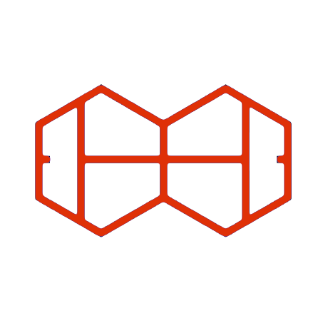

<p align="center">
  <a href="http://courthive.com/" target="blank"></a>
</p>
<p align="center">Competition Business Rules and Policy Management.</p>
<p align="center"><a href='https://courthive.github.io/competition-factory/'>Onilne Documentation and Examples.</a></p>
<p align="center">
<a href="https://www.npmjs.com/~tods-competition-factory" target="_blank"></a>
<a href="https://www.npmjs.com/~tods-competition-factory" target="_blank"></a>
<a href="https://www.npmjs.com/~tods-competition-factory" target="_blank"></a>
</p>

## Competittion Business Rules

The **Competition Factory** is a collection of functions for transforming/mutating tournament records and is intended to ensure the integrity of Competitions by managing all state transformations. Factory functions embody the "business rules" required by Competition Management Solutions, and enable an entirely new way of constructing software to manage tournaments.

The rules governing the creation of draws, seeding, and participant movement can be present on a standalone client, on a server, or both.
An entire tournament management solution [can run in a browser](https://courthive.github.io/TMX/), or a client can communicate with a server which utilizes a database, or simply the file system.

Server deployments support highly scaleable asynchronous processing models in **Node.js**.

## Data => Standards

The Competition Factory generates and processes / mutates JSON objects, and was built during the development of the **[Tennis Open Data Standards](https://itftennis.atlassian.net/wiki/spaces/TODS/overview)**, **(TODS)**, a document-based representation of all of the elements of a tournament or a league including participants, events, draws, matchUps, contacts, and references to online resources. Although the data standard began to emerge in the sport of Tennis, **_the data structures apply to competitions in many sports_**, and the factory continues to evolve to support competition more broadly.

## Time Capsule

After a tournament has been completed, a **TODS** file can be considered a "time capsule" of all the information related to the constructrion and management of a tournament or a league. This means that complete historical data is available in one cross-platform, database-independent JSON file, removing all concerns about keeping software maintenance contracts active in order to retain access to data, as well as any reliance on applications which interpret database schemas.

## State Engines

The **Competition Factory** includes synchronous and asynchronous "state engines" which provide services for managing the state of a tournament record as well as subscriptions, notifications and logging.

## Mocks Engine

The `mocksEngine` generates complete tournament objects, or tournamentRecords, as well as mock persons, participants and matchUp outcomes. It is used extensively in the 2600+ tests that are run against the factory methods before every package release.

## Installation

```bash
$ pnpm i tods-competition-factory
```
