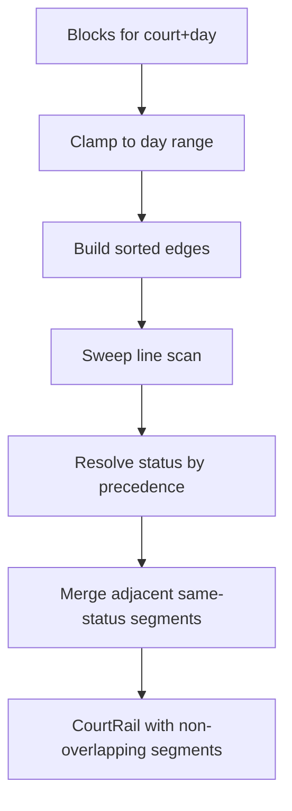

This page covers the domain-specific technical details of the TemporalEngine: the inverted availability paradigm, block types, the sweep-line rail derivation algorithm, capacity curves, collision detection, time granularity, and the CODES bridge.

## The Inverted Paradigm

The TemporalEngine uses an **inverted model** — instead of tracking when courts are available, it tracks when they are _unavailable_. Available time is whatever remains after all blocks are accounted for.

| Aspect                | Traditional Model            | Temporal Engine                               |
| --------------------- | ---------------------------- | --------------------------------------------- |
| Canonical state       | Available time slots         | Blocks (unavailable time)                     |
| Adding unavailability | Remove/split available slots | Add a block                                   |
| Querying availability | Read available slot list     | Derive rails (subtract blocks from day range) |
| Overlap resolution    | Merge available slots        | Precedence-based sweep line                   |
| Storage efficiency    | Grows with available time    | Grows with constraints                        |

This approach is particularly effective for tournament scheduling where courts start fully available and constraints are added incrementally — a few maintenance windows, practice blocks, and reserved periods define the day's shape more compactly than enumerating every free slot.

## Block Types

| Type          | Meaning                           | Typical Source  | Category        |
| ------------- | --------------------------------- | --------------- | --------------- |
| `MAINTENANCE` | Court under maintenance           | Template / User | Hard constraint |
| `PRACTICE`    | Reserved for practice             | User            | Soft constraint |
| `RESERVED`    | Reserved (general purpose)        | User / System   | Soft constraint |
| `BLOCKED`     | Generically blocked               | User            | Hard constraint |
| `CLOSED`      | Court closed for the day          | System          | Hard constraint |
| `SCHEDULED`   | Match scheduled here              | System (import) | Informational   |
| `SOFT_BLOCK`  | Soft block (can be overridden)    | User / Rule     | Soft constraint |
| `HARD_BLOCK`  | Hard block (cannot be overridden) | User / Rule     | Hard constraint |
| `LOCKED`      | Locked — immutable                | System          | Hard constraint |
| `AVAILABLE`   | Explicitly available              | Derived         | Free time       |
| `UNSPECIFIED` | Unknown/default                   | Fallback        | Neutral         |

**Default `typePrecedence`:**

```js
['HARD_BLOCK', 'LOCKED', 'MAINTENANCE', 'BLOCKED', 'PRACTICE', 'RESERVED', 'SOFT_BLOCK', 'AVAILABLE', 'UNSPECIFIED'];
```

When multiple blocks overlap on the same court at the same time, the block with the highest precedence (leftmost in the array) wins.

### Block Interface

```ts
interface Block extends TimeRange {
  id: BlockId;
  court: CourtRef;
  type: BlockType;
  reason?: string;
  priority?: number;
  hardSoft?: BlockHardness; // 'HARD' | 'SOFT'
  recurrenceKey?: string;
  source?: BlockSource; // 'USER' | 'TEMPLATE' | 'RULE' | 'SYSTEM'
  matchUpId?: string; // For SCHEDULED blocks
}
```

## Rail Derivation Algorithm

The core algorithm transforms overlapping blocks into non-overlapping **rail segments** using a sweep-line approach. This runs every time you call `getCourtRail()`, `getDayTimeline()`, or `getVenueTimeline()`.



### Algorithm Steps

1. **Clamp** — Each block is clamped to the court's availability window for the day. Blocks entirely outside the window are discarded.

2. **Build edges** — Each block produces two edges: a `START` edge and an `END` edge. Edges are sorted by time, with `END` edges before `START` edges at the same time (to avoid zero-width overlaps).

3. **Sweep** — A scan pointer moves left-to-right through sorted edges. At each edge, the set of "active" blocks changes (a block is added at its START, removed at its END).

4. **Resolve** — At each transition point, the effective status is determined by finding the highest-precedence block type among active blocks, using the `typePrecedence` array.

5. **Merge** — Adjacent segments with the same status are merged into a single segment, reducing the total segment count.

### Key Interfaces

```ts
interface RailSegment extends TimeRange {
  status: BlockType; // Effective status after precedence resolution
  contributingBlocks: BlockId[]; // All blocks that overlap this segment
}

interface CourtRail {
  court: CourtRef;
  segments: RailSegment[]; // Non-overlapping, sorted by start time
}

interface VenueDayTimeline {
  day: DayId;
  venueId: VenueId;
  rails: CourtRail[]; // One rail per court
}
```

### Visualization Example

Given three overlapping blocks on a court:

```text
Block A (PRACTICE):    |████████████████|
Block B (MAINTENANCE):        |██████████████|
Block C (RESERVED):                 |████████████████|
Time:              08:00  09:00  10:00  11:00  12:00  13:00

Derived Rail Segments:
  [08:00–09:00] PRACTICE      (only A active)
  [09:00–10:00] MAINTENANCE   (A+B active, MAINTENANCE wins by precedence)
  [10:00–11:00] MAINTENANCE   (A+B+C active, MAINTENANCE still wins)
  [11:00–12:00] RESERVED      (B+C active, but B ends at 11:00 → only C)
  [12:00–13:00] RESERVED      (only C active)
```

After merge: segments at `[09:00–10:00]` and `[10:00–11:00]` both have status `MAINTENANCE`, so they merge into `[09:00–11:00] MAINTENANCE`.

### Key Functions

```ts
// Core derivation — called by TemporalEngine.getCourtRail()
deriveRailSegments(blocks: Block[], dayRange: TimeRange, config: EngineConfig): RailSegment[]

// Supporting utilities
clampToDayRange(block: Block, dayRange: TimeRange): Block | null
buildEdges(blocks: Block[]): Edge[]
sortEdges(edges: Edge[]): Edge[]
resolveStatus(contributingIds: BlockId[], blocksById: Map<BlockId, Block>, precedence: BlockType[]): BlockType
mergeAdjacentSegments(segments: RailSegment[]): RailSegment[]
```

## Capacity Curves

Capacity curves aggregate rail data across all courts to show total availability over time — how many courts are available, soft-blocked, or hard-blocked at each time point.

### Key Interfaces

```ts
interface CapacityPoint {
  time: string;
  courtsAvailable: number;
  courtsSoftBlocked: number;
  courtsHardBlocked: number;
}

interface CapacityCurve {
  day: DayId;
  points: CapacityPoint[];
}

interface CapacityStats {
  peakAvailable: number;
  peakTime: string;
  minAvailable: number;
  minTime: string;
  avgAvailable: number;
  totalCourtHours: number;
  utilizationPercent: number;
  totalCourts?: number;
  totalAvailableHours?: number;
  totalUnavailableHours?: number;
  availablePercent?: number;
  avgBlockedHoursPerCourt?: number;
}
```

### Usage

```js
const curve = engine.getCapacityCurve('2026-06-15');

// Compute statistics
import { calculateCapacityStats } from 'tods-competition-factory';
const stats = calculateCapacityStats(curve);
console.log(`Peak: ${stats.peakAvailable} courts at ${stats.peakTime}`);
console.log(`Utilization: ${stats.utilizationPercent}%`);

// Filter to a time window
import { filterCapacityCurve } from 'tods-competition-factory';
const morning = filterCapacityCurve(curve, {
  start: '2026-06-15T08:00:00',
  end: '2026-06-15T12:00:00',
});

// Compare before/after
import { compareCapacityCurves } from 'tods-competition-factory';
const diffs = compareCapacityCurves(baselineCurve, modifiedCurve);
```

### Additional Capacity Functions

```ts
// Resample a curve at a different interval
sampleCapacityCurve(curve: CapacityCurve, intervalMinutes: number): CapacityCurve

// Compare two curves point by point
compareCapacityCurves(baseline: CapacityCurve, modified: CapacityCurve): CapacityDiff[]
```

## Collision Detection

Collision detection prevents blocks from overlapping during interactive drag-and-drop operations. The engine uses **half-open intervals** `[start, end)` — a block occupying `[09:00, 10:00)` does NOT overlap with a block at `[10:00, 11:00)`. Adjacency is not overlap.

### Key Functions

```ts
// Check if two time ranges overlap (half-open interval semantics)
intervalsOverlap(a: TimeRange, b: TimeRange): boolean

// Check if a time point falls inside a block
timeInsideBlock(time: number, block: Block): boolean

// Find all blocks containing a specific time point
findBlocksContainingTime(time: number, blocks: Block[]): Block[]

// Clamp a drag gesture to avoid collisions with existing blocks
clampDragToCollisions(
  anchorTime: number,
  cursorTime: number,
  blocks: Block[],
): {
  start: number;
  end: number;
  clamped: boolean;
  clampedBy?: Block;
  direction: 'forward' | 'backward';
}
```

### clampDragToCollisions

This is the primary function used during interactive block creation (paint mode). Given an anchor point (where the drag started) and a cursor position (where the drag currently is), it computes the largest valid time range that doesn't overlap any existing blocks:

```js
import { clampDragToCollisions } from 'tods-competition-factory';

// User started dragging at 09:00, cursor is now at 11:00
// But there's a block from 10:00-10:30
const result = clampDragToCollisions(540, 660, existingBlocks);
// result: { start: 540, end: 600, clamped: true, direction: 'forward' }
// The drag is clamped to 09:00–10:00 (stops at the block boundary)
```

## Time Granularity

All times in the engine snap to a configurable granularity (default 15 minutes). The `timeGranularity` module provides utilities for snapping and iterating.

### Key Functions

```ts
// Convert 'HH:MM' to minutes since midnight
hhmmToMinutes(hhmm: string): number
// hhmmToMinutes('09:30') → 570

// Convert minutes since midnight to 'HH:MM'
minutesToHhmm(minutes: number): string
// minutesToHhmm(570) → '09:30'

// Snap a minute value to the nearest granularity boundary
snapToGranularity(minutes: number, granularity: number, mode?: 'floor' | 'ceil' | 'round'): number
// snapToGranularity(37, 15) → 30   (floor, default)
// snapToGranularity(37, 15, 'ceil') → 45

// Snap an ISO datetime string to granularity
snapIsoToGranularity(iso: string, granularity: number, mode?: 'floor' | 'ceil' | 'round'): string

// Iterate time ticks at granularity intervals
function* iterateDayTicks(startHhmm: string, endHhmm: string, granularity: number): Generator<string>
// [...iterateDayTicks('08:00', '10:00', 30)] → ['08:00', '08:30', '09:00', '09:30', '10:00']
```

## CODES Bridge

The bridge module provides bidirectional translation between TemporalEngine structures and [CODES](/docs/data-standards#codes) (Competition Open Data Exchange Standards) tournament record structures.

### Engine → CODES

```ts
// Convert derived rails to CODES dateAvailability entries
railsToDateAvailability(
  timelines: VenueDayTimeline[],
  config?: BridgeConfig,
): TodsDateAvailability[]

// Write engine availability back into a tournament record
applyTemporalAvailabilityToTournamentRecord(params: {
  tournamentRecord: any;
  timelines: VenueDayTimeline[];
  config?: BridgeConfig;
  engine?: TemporalEngine;
}): any
```

### CODES → Engine

```ts
// Convert CODES venue availability to engine blocks
todsAvailabilityToBlocks(params: {
  venue: TodsVenue;
  tournamentId: string;
  blockType?: BlockType;
}): Array<{ court: CourtRef; start: string; end: string; type: BlockType }>
```

### Scheduling Profile Bridge

```ts
// Convert UI scheduling selections to a factory scheduling profile
buildSchedulingProfileFromUISelections(
  selections: SchedulingSelection[],
): SchedulingProfile

// Validate a scheduling profile's structural format
validateSchedulingProfileFormat(profile: SchedulingProfile): {
  valid: boolean;
  errors: string[];
}
```

### BridgeConfig

```ts
interface BridgeConfig {
  courtToCourtId?: (courtRef: CourtRef) => string;
  isSchedulableStatus?: (status: BlockType) => boolean;
  aggregateByVenue?: boolean;
}
```

### Utility Functions

```ts
// Validate date availability entries
validateDateAvailability(entries: TodsDateAvailability[]): { valid: boolean; errors: string[] }

// Merge overlapping availability entries
mergeOverlappingAvailability(entries: TodsDateAvailability[]): TodsDateAvailability[]

// Calculate total court-hours from availability entries
calculateCourtHours(entries: TodsDateAvailability[]): number
```

---

## Related Documentation

- **[Overview](./temporal-engine-overview)** — Introduction and architecture
- **[Core API Reference](./temporal-engine-api)** — Complete method reference
- **[Event System & Validation](./event-system-and-validation)** — Events, conflict evaluators, and validation pipeline
- **[UI Integration Scenarios](./ui-integration-scenarios)** — Building UIs with engine data
